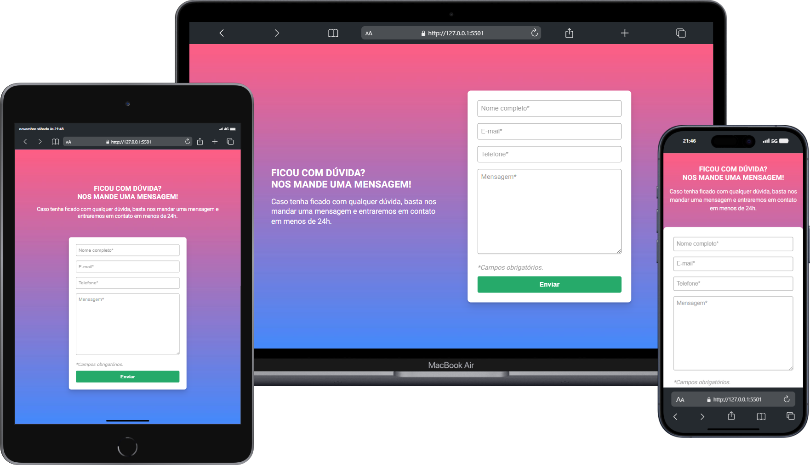

<h1>Validação de Formulário</h1>

### 📝 Quest "HTML, CSS e JavaScritp Intermediário"

 

### 📜 Descrição:
Esse projeto foi desenvolvido no curso DevQuest Frontend, com intenção de aprimorar as habilidades adquiridas em HTML, CSS e JavaScript. O projeto consiste em um formulário de mensagem onde é feita a validação dos campos, e caso algum campo não esteja preenchido corretamente, o formulário apresentará a mensagem de campo obrigatório.

 

### 🚀 Tecnologias Utilizadas:

    
    
    

 

### 📸 Preview:

